# Cooler Calls — field-service CRM for Denise's refrigeration business

> **Live demo:** https://cooler-calls-crm.vercel.app · **Demo login:** pick a user, no password. · **Code:** https://github.com/ayushdueby/GushWork-FDE-assignment

Denise runs a commercial refrigeration repair company: walk-in coolers, freezers and ice machines for restaurants, grocery stores and warehouses. Four techs in the field, her husband on the books part-time, 15–20 new leads a week plus repeat customers. Leads arrive from five scattered places — the office line ringing her cell, a website form that lands in an email inbox, texts from repeat customers and referrals, and a paper notebook.

In her words:

> "Last week a restaurant called on a Friday, freezer down, and I forgot to follow up because I was slammed, and by Monday they had called someone else. That is a two thousand dollar job gone."
>
> "Did I send the quote? Did they say yes? Is tech scheduled? I do not have a good picture. My husband keeps asking me for numbers and I cannot even tell him how many open jobs we have."
>
> "I just want to wake up and know who I need to call today … Who to call today, and where each job is at. Waiting on quote, waiting on their yes, scheduled, done. That is it."

Cooler Calls is a multi-module CRM built around that sentence. Every channel feeds one pipeline, every job has one stage, and every morning starts with one list.

## How each module answers a specific pain from the call

| What Denise said | Module | What it does |
|---|---|---|
| "I forgot to follow up … by Monday they had called someone else." | **Today** | A rule-built call list, urgent in red at the top, with how long each person has waited and an AI-suggested next step. Nobody drops off it until the job moves. The seed data includes that exact Friday freezer voicemail; it's the first row. |
| "Some fill out the form on our website, that goes to an email … a lot just text me." | **Inbox** | Email, SMS and the website form land in one threaded list. Each message is read by Groq (rule-based fallback), matched to a customer by phone / email / fuzzy business name, and becomes a new job — or lands on the open one. "Yes, go ahead" moves the quoted job to approved on its own. |
| "Some people call the office line, that rings to my cell." | **Dialer** | Keypad, click-to-call from anywhere, contact match as you type. Calls are recorded from the mic, transcribed by Groq Whisper, and turned into a field-by-field diff (urgency, quote amount, decision, date, stage) she applies with one click. A missed call becomes a lead at the top of Today. |
| "Did I send the quote? Did they say yes?" | **Jobs** + **Quotes** | Kanban by stage (drag to move; the app asks for what the stage needs). Quotes are built from a price list, totalled on the server, printable/PDF, and sent with a public link where the customer accepts or declines — which moves the job and notifies Denise. Quotes going quiet for 2+ days come back to Today with a one-click reminder. |
| "Is tech scheduled?" | **Schedule** + **Tech view** | A week board with a lane per tech; drag an approved job onto a slot. Double-bookings are flagged. Techs get a phone-first view of their own jobs with maps and tel links, "On my way" (texts the customer) and "Mark done" with notes and a photo. |
| "My husband keeps asking me for numbers." | **Reports** + roles | Pipeline value by stage, leads by source, quote win rate, first-response time, leads that never got a response, revenue by week/month, jobs per tech, date range and CSV export. Ray logs in as bookkeeper and sees Reports, Quotes and Customers read-only. |

The one continuous story the app is built to demo (and the E2E suite runs): **inbound email → lead on Today → call from Today → apply the transcript → build and send the quote → customer accepts at the public link → drag onto a tech's schedule → tech marks it done → reports move.**

## Modules

| | |
|---|---|
| 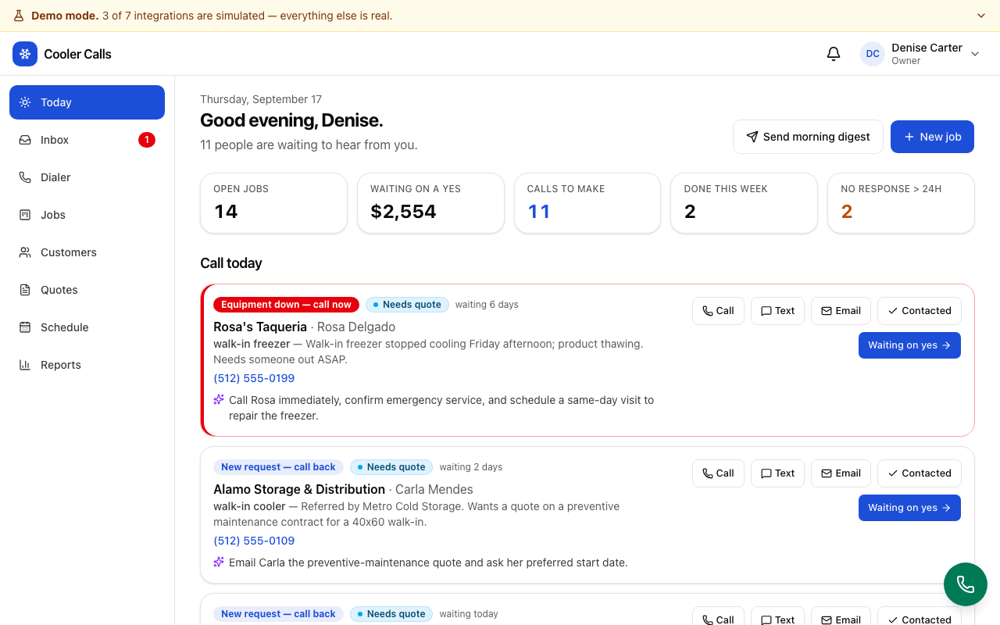 **Today** — the morning list with KPIs, reasons and AI next steps | 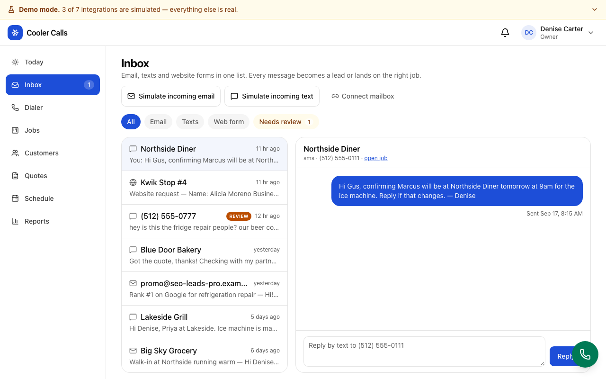 **Inbox** — one thread list for email, texts and web forms, with the extraction to accept, edit or reject |
| 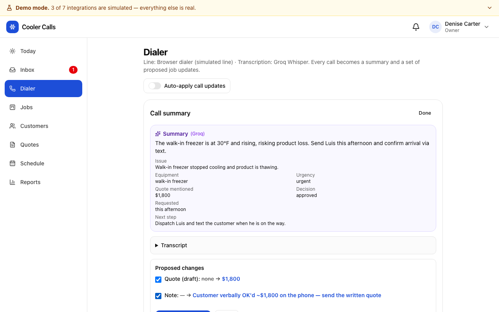 **Dialer** — call summary and the proposed job changes | 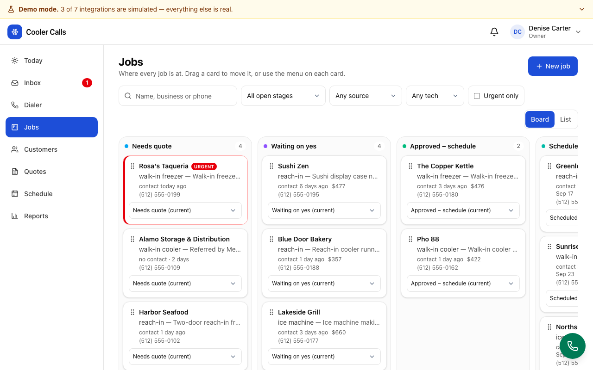 **Jobs** — kanban by stage with drag-and-drop |
| 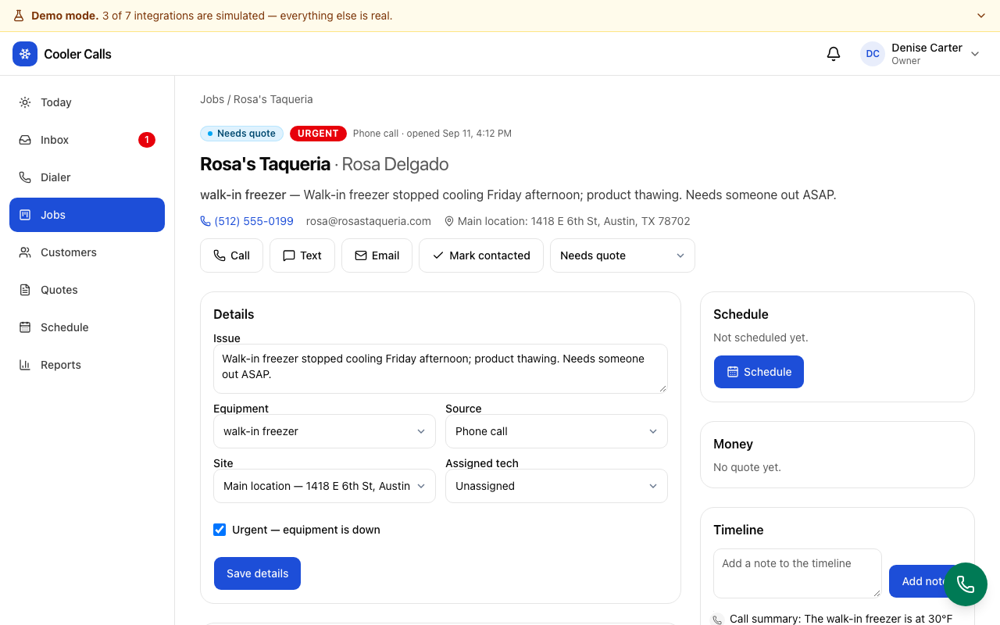 **Job detail** — details, quotes, calls, messages, timeline | 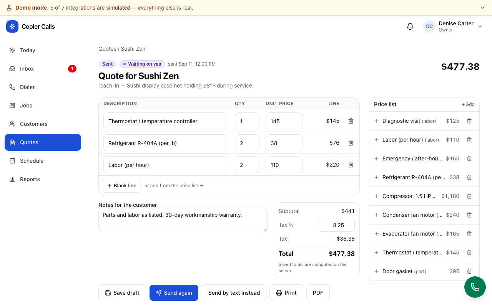 **Quote builder** — price list, server-side totals, print/PDF, send |
| 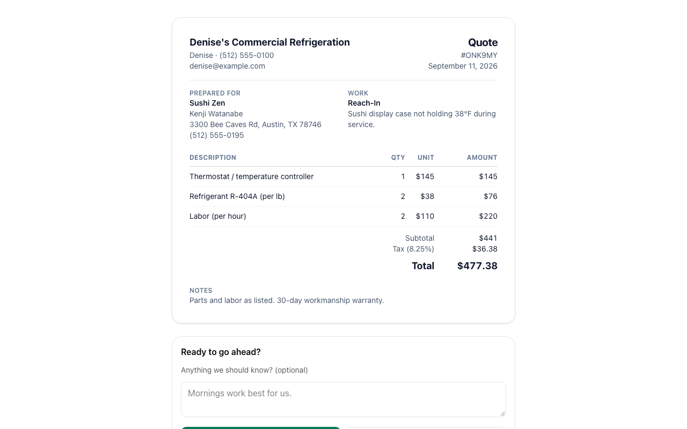 **Public quote page** — accept or decline once, no login | 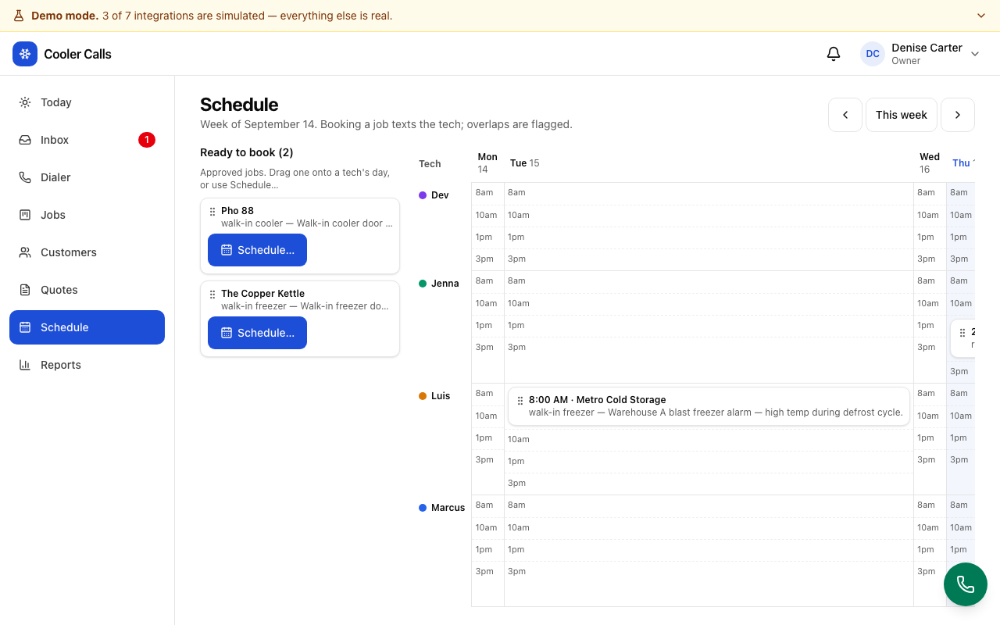 **Schedule** — week board, lane per tech, drag to book |
| 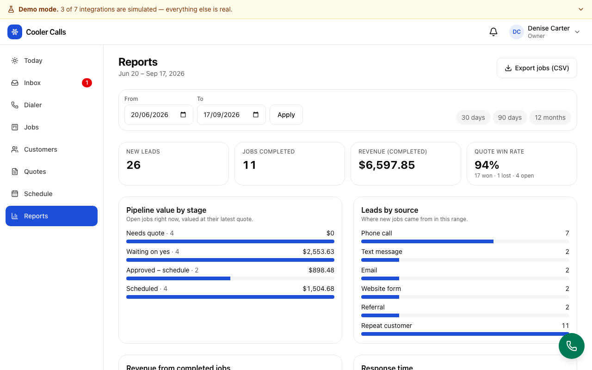 **Reports** — the numbers for the bookkeeper | 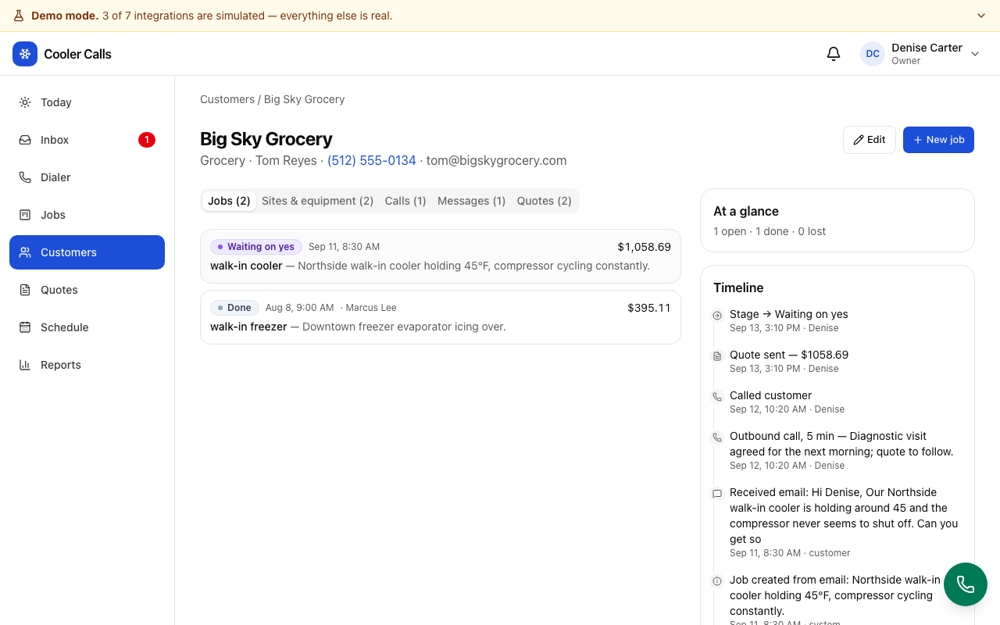 **Customer** — sites, equipment, jobs, calls, messages, quotes, one timeline |
| 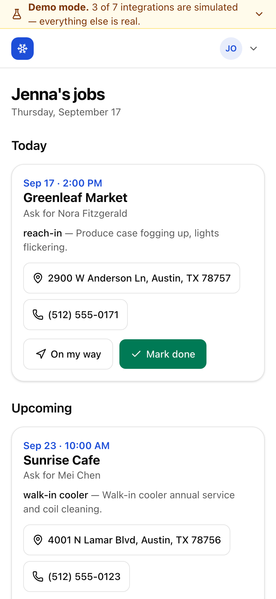 **Tech view** on a phone | 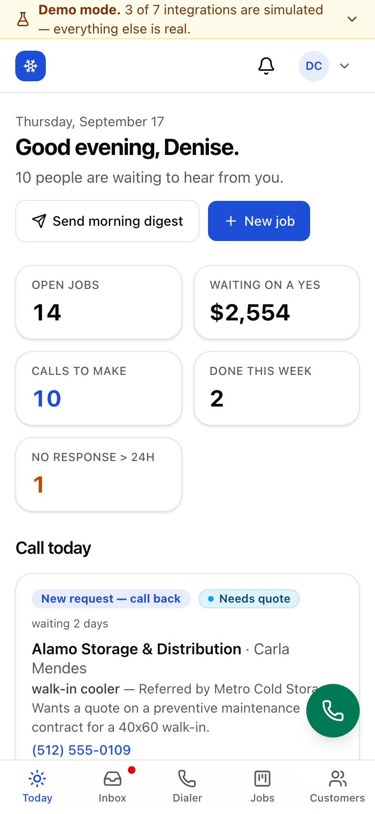 **Today** on a phone |

## Architecture

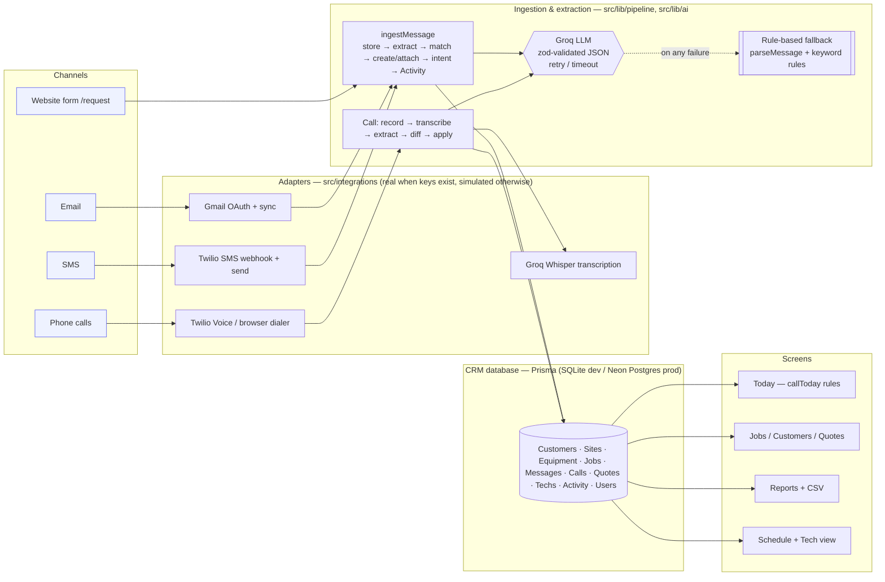

The follow-up rules (`src/lib/rules/callToday.ts`) and the message parser (`src/lib/parse/parseMessage.ts`) are ported from the earlier `cooler-calls` prototype with their unit tests intact, plus one new rule for missed calls.

**Follow-up rules, in priority order** (each open job appears once, under its first matching reason; urgent first, then longest waiting; done/lost never appear; days are calendar days):

1. Urgent + needs quote, not contacted today → **Equipment down — call now** (red)
2. Unreturned missed call → **Missed call — call back**
3. Needs quote, never contacted → **New request — call back**
4. Needs quote, contacted, no quote after 1 day → **Send the quote**
5. Waiting on yes, no contact for 2+ days → **Follow up on quote** (with a one-click reminder)
6. Approved → **Book a tech**
7. Scheduled with a date in the past → **Confirm job is done**
8. Any other open job with no contact for 2+ days → **Hasn't heard from us in X days**

Forward stage moves, calls, texts, emails and sent quotes count as contact; backward moves and "lost" don't.

## Real vs simulated

| Piece | Default | How to switch it on |
|---|---|---|
| LLM extraction & suggestions | **Real** — Groq (`GROQ_MODEL`, default `llama-3.3-70b-versatile`; if Groq rejects it the app lists models and picks the closest, e.g. `openai/gpt-oss-120b`) | Set `GROQ_API_KEY`. Without it everything runs on the deterministic parser/rules. |
| Call transcription | **Real** — Groq Whisper (`GROQ_STT_MODEL`, default `whisper-large-v3-turbo`) | Same key. Without it the dialer asks you to type notes. |
| Call recording | **Real** — browser `MediaRecorder` from the mic, uploaded on hang-up | Allow the mic prompt. Denied / empty / failed → typed notes. |
| Database | **Real** — SQLite locally, Neon Postgres in production | `DATABASE_URL` (the Prisma provider flips automatically). |
| Inbound & outbound email | Simulated (preview of exactly what would be sent) | `GMAIL_CLIENT_ID`, `GMAIL_CLIENT_SECRET`, then Inbox → **Connect mailbox** → store `GMAIL_REFRESH_TOKEN`. Sync from the Inbox or `POST /api/gmail/sync` with `x-cron-secret`. |
| SMS | Simulated | `TWILIO_ACCOUNT_SID`, `TWILIO_AUTH_TOKEN`, `TWILIO_FROM_NUMBER`; point the number's SMS webhook at `POST {APP_URL}/api/webhooks/twilio/sms`. Signatures are verified. |
| Outbound telephony / inbound calls | Simulated (browser dialer; "Simulate incoming call") | Same Twilio keys + `OFFICE_PHONE`; voice webhook at `POST {APP_URL}/api/webhooks/twilio/voice`. No-answer and voicemail become missed-call leads. |

The **Demo mode** banner at the top of the app lists live which adapters are real.

## Setup

```bash
npm install                 # also runs prisma generate
cp .env.example .env.local  # add GROQ_API_KEY (optional but recommended)
npm run setup               # prisma db push + seed (SQLite, dated relative to today)
npm run dev                 # http://localhost:3000
```

Sign in as **Denise Carter** (owner), **Ray Carter** (bookkeeper) or any tech. Owner → **Reset demo data** at the bottom of Today re-seeds everything relative to the current date.

### Environment variables

See [`.env.example`](.env.example). Required: `DATABASE_URL`, `APP_URL`, `SESSION_SECRET`. Recommended: `GROQ_API_KEY`, `GROQ_MODEL`, `GROQ_STT_MODEL`. Optional integrations: Twilio (`TWILIO_ACCOUNT_SID`, `TWILIO_AUTH_TOKEN`, `TWILIO_FROM_NUMBER`, `OFFICE_PHONE`), Gmail (`GMAIL_CLIENT_ID`, `GMAIL_CLIENT_SECRET`, `GMAIL_REFRESH_TOKEN`, `GMAIL_FROM`), `CRON_SECRET`, `RECORDINGS_DIR`. Test switches: `GROQ_MOCK=1`, `AI_DISABLED=1`. The Groq key is read server-side only and never reaches the browser.

### Production (Vercel + Neon)

1. Create a free Neon project and copy the pooled connection string.
2. `DATABASE_URL=<neon url> npx prisma db push && DATABASE_URL=<neon url> npx tsx prisma/seed.ts`
3. `vercel` — set `DATABASE_URL`, `APP_URL`, `SESSION_SECRET`, `GROQ_API_KEY`, `GROQ_MODEL`, `GROQ_STT_MODEL` (and `RECORDINGS_DIR=/tmp/recordings`) as project env vars. The build runs `scripts/prisma-provider.mjs`, which switches the Prisma datasource to `postgresql` when `DATABASE_URL` starts with `postgres`.

## Tests

```bash
npm test          # Vitest — 137 unit tests (rules, parser, matching, pipeline, AI fallback, call diff, quotes, permissions)
npm run test:e2e  # Playwright — desktop + Pixel 5; builds the app, seeds its own SQLite, mocks Groq
```

E2E covers the full story above, web-form leads, missed-call leads, every role's page/API reach (direct URLs included), XSS rendered as text, double-click stage safety, and an axe (WCAG 2A/AA, serious+critical) pass over Today, Dialer, Inbox, Jobs, Schedule and the public quote page plus a no-horizontal-scroll check. Both suites were run three times in a row with no flakes; `npm run build` and `npm run lint` are clean.

## Two-minute demo script

1. **Login → Today.** "This is Denise at 6am. Eleven people are waiting. Rosa's Taqueria is red: freezer down since Friday, nobody called back — that's the $2,000 job." Point at the AI next step.
2. **Inbox → Simulate incoming email → New urgent request.** The email is read, a customer and an urgent job are created, it's flagged for review. Click **Accept**. Back on **Today**, Santos Taqueria is now the top row.
3. **Call** on that row → dialer opens prefilled. **Play sample call → New urgent request (price mentioned).** Show the transcript, the summary, and the proposed changes (draft quote $1,800). **Apply.**
4. **Open the job → Build a quote.** The $1,800 draft is there; **Send quote.** Show the simulated email and the public link. Open it in another tab as the customer, **Accept**. Back in the app the bell rings and the job is *Approved*.
5. **Schedule.** Drag Santos onto Marcus's Thursday 10am. The tech gets a (simulated) text; overlaps would be flagged.
6. **Switch user → Marcus Lee.** Phone-sized tech view: **On my way** texts the customer; **Mark done** with notes.
7. **Switch user → Ray Carter.** Reports: completed jobs and revenue moved; try any other page — the server sends him back.
8. **Back as Denise → Send morning digest.** The list she'd get by text at 7am.

## Decisions and trade-offs

- **Rules first, AI second.** The Today list is a pure function so the same data gives the same list every morning. Groq writes the suggestion text and reads messages/calls, but every AI call is zod-validated with retries and falls back to deterministic rules — the product never blocks on the model.
- **One pipeline for every channel.** Email, SMS, web form and (via Twilio) voicemail all go through `ingestMessage`, so matching, dedupe and intent handling are written and tested once. Simulated and real adapters feed the same function.
- **Server-side everything that matters.** Permissions in `proxy.ts`, every server action and every route handler; quote totals; stage transitions (a double-click can't skip a stage; a quote can be answered once, even under concurrent requests).
- **Prisma without enums/Json** so the same schema runs on SQLite locally and Postgres in production; the provider is flipped at build time.
- **Simulated telephony.** Real outbound calls need a Twilio number and a phone on the other end. The browser dialer records the mic and runs the real transcription/extraction path, and the Twilio adapters are implemented and inactive without keys.
- **Recordings** are saved to disk when the filesystem is writable (local) and skipped on serverless; the transcript is what the product needs.

**Deliberately not built:** invoicing/payments, inventory, a customer portal beyond the quote page, native mobile apps (the tech view is a mobile web page), true multi-tenant auth (the demo login is a signed cookie, not authentication).

**Next steps:** real Gmail + Twilio numbers (adapters are in place); a 7am scheduled digest via cron (`sendDigest` is ready); multi-user sync is already covered by the shared DB; AI call coaching from the transcripts; a Java/Spring Boot backend for scale if the pipeline outgrows Next.js route handlers.
